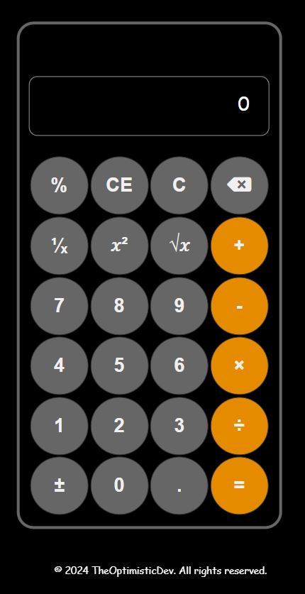

# Calculator App

A simple and responsive calculator web application built with HTML, CSS, and JavaScript by Mfumu Wealth Mabunda.

## Table of Contents

- [Features](#features)
- [Screenshot](#Screenshot)
- [Installation](#installation)
- [Usage](#usage)
- [How it Works](#how-it-works)
- [Technologies Used](#technologies-used)
- [Contributing](#contributing)
- [Host](#hosted-on-netlify)
- [Attributions](#attributions)
- [License](#license)

## Features

- Basic arithmetic operations: addition, subtraction, multiplication, and division.
- Responsive design for optimal user experience on various devices.
- Clear button to reset the calculator.

## Screenshot

- 

## Installation

1. Clone the repository:

   ```bash
   git clone https://github.com/your-username/calculator-app.git

## Usage

1. Start performing calculations by clicking the buttons on the calculator.
2. Use the clear button to reset the calculator for a new calculation.

## How it Works

The calculator performs basic arithmetic operations and displays the result on the screen. The clear button resets the calculator, allowing users to start a new calculation.

## Technologies Used

- HTML
- CSS
- JavaScript

## Contributing

- If you'd like to contribute to this project, please follow these guidelines:

1. Fork the repository.
2. Create a new branch for your feature or bug fix: git checkout -b feature-name.
3. Commit your changes: git commit -m 'Add a new feature'.
4. Push to the branch: git push origin feature-name.
5. Submit a pull request.

## Hosted on Netlify

This calculator app is hosted on [Netlify](https://www.netlify.com/). You can access the live version of the app [here](https://mfumu-calculator.netlify.app).

## Attributions

- Font Awesome Icons: Icons used in this project are provided by [Font Awesome](https://fontawesome.com/), with attribution to [Font Awesome](https://fontawesome.com/) required as per their license.

- Favicon: The favicon for this app was generated using [favicon.io](https://favicon.io/).

- CDN: This project uses the [Cloudflare CDN](https://www.cloudflare.com/) for content delivery, ensuring a faster and more reliable user experience.

## License

- This project is licensed under the MIT License - see the LICENSE file for details.